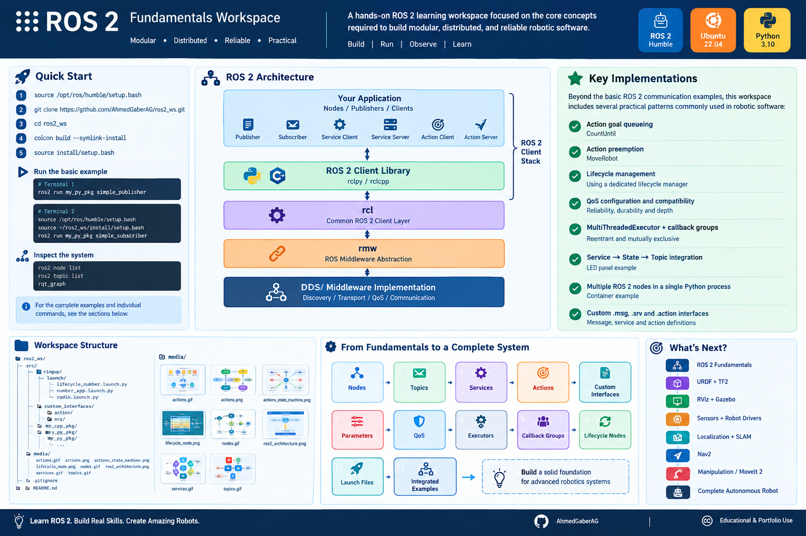
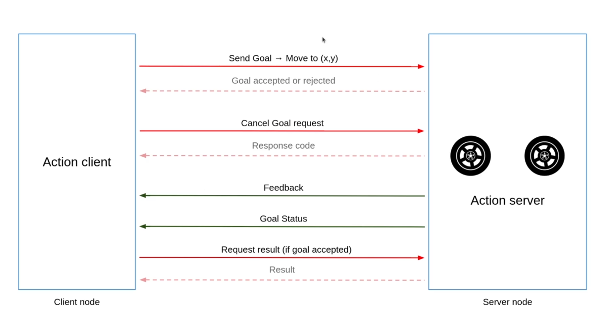
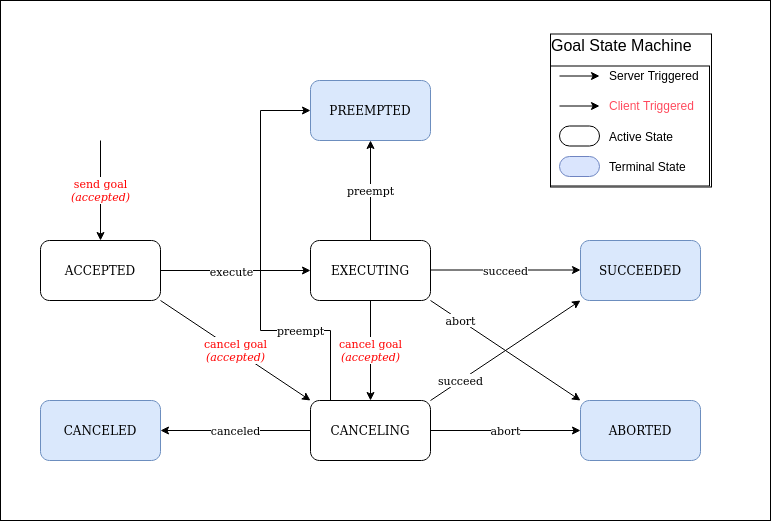
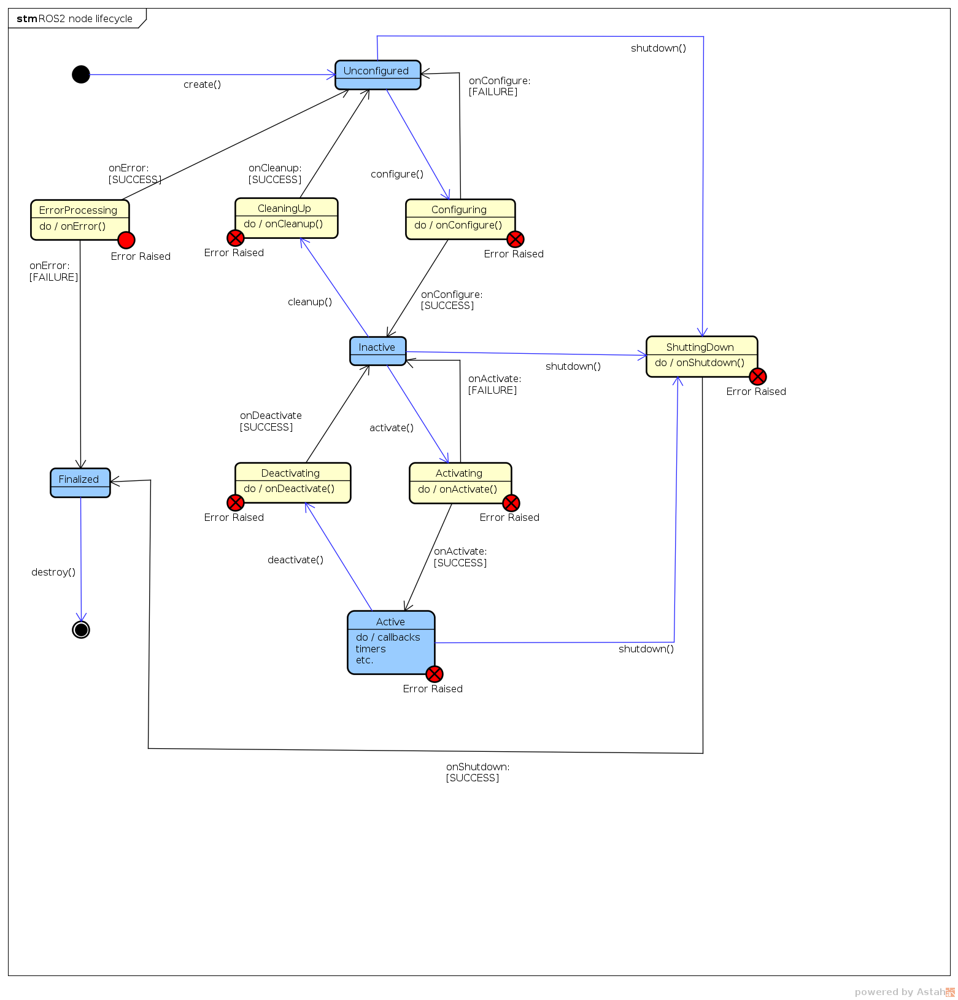

# ROS 2 Fundamentals Workspace




A practical ROS 2 learning workspace focused on understanding the core concepts required to build modular, distributed, and reliable robotic software.

This repository implements ROS 2 fundamentals through small, independent examples and progressively connected applications using **Python**, **custom interfaces**, **services**, **actions**, **parameters**, **QoS**, **executors**, **callback groups**, **lifecycle nodes**, and **launch files**.

The goal is not only to explain ROS 2 concepts, but to make each concept **runnable, observable, and testable from the ROS 2 CLI**.

---

## 📌 Overview

ROS 2 is a middleware framework for developing distributed robotic applications.

Instead of building a robot as one large application, ROS 2 allows the system to be divided into independent **nodes** that communicate through standardized interfaces.

This workspace demonstrates how these building blocks work together:

```text
                    ROS 2 Application
                           │
          ┌────────────────┼────────────────┐
          │                │                │
        Nodes           Interfaces       Launch
          │                │                │
     ┌────┴────┐      ┌────┼────┐          │
     │         │      │    │    │          │
  Topics   Services  Msg  Srv  Action       │
     │         │      │    │    │           │
     └─────────┴──────┴────┴────┴───────────┘
                           │
                     ROS 2 Middleware
                           │
                          DDS
```

---

## ⚡ Quick Start

### 1. Source ROS 2

```bash
source /opt/ros/humble/setup.bash
```

### 2. Clone the repository

```bash
git clone https://github.com/AhmedGaberAG/ros2_ws.git
cd ros2_ws
```

### 3. Build the workspace

```bash
colcon build --symlink-install
```

### 4. Source the workspace

```bash
source install/setup.bash
```

### 5. Run the basic publisher/subscriber example

Terminal 1:

```bash
ros2 run my_py_pkg simple_publisher
```

Terminal 2:

```bash
source /opt/ros/humble/setup.bash
source ~/ros2_ws/install/setup.bash

ros2 run my_py_pkg simple_subscriber
```

Inspect the running system:

```bash
ros2 node list
ros2 topic list
rqt_graph
```

For the complete examples and individual commands, see the sections below.

---

## 📑 Table of Contents

* [Overview](#-overview)
* [Quick Start](#-quick-start)
* [What This Workspace Covers](#-what-this-workspace-covers)
* [ROS 2 Architecture](#️-ros-2-architecture)
* [Workspace Structure](#-workspace-structure)
* [Installation & Build](#️-installation--build)
* [Nodes](#1-nodes)
* [Topics](#2-topics)
* [Services](#3-services)
* [Custom Services](#4-custom-services)
* [Actions](#5-actions)
* [Fibonacci Action](#6-fibonacci-action)
* [Action Goal Management](#7-action-goal-management)
* [Parameters](#8-parameters)
* [QoS](#9-qos--quality-of-service)
* [Executors](#10-executors)
* [Callback Groups](#11-callback-groups)
* [Lifecycle Nodes](#12-lifecycle-nodes)
* [Lifecycle Number Publisher](#13-lifecycle-number-publisher)
* [Launch Files](#14-launch-files)
* [Launching Multiple Instances](#15-launching-multiple-instances)
* [Custom Interfaces](#16-custom-interfaces)
* [Hardware Status Example](#17-hardware-status-example)
* [Battery + LED State Machine](#18-battery--led-state-machine)
* [Multiple Nodes in One Process](#19-multiple-nodes-in-one-process)
* [Recommended Learning Path](#-recommended-learning-path)
* [ROS 2 CLI Cheat Sheet](#-ros-2-cli-cheat-sheet)
* [What This Repository Demonstrates](#-what-this-repository-demonstrates)
* [Scope of This Repository](#-scope-of-this-repository)
* [Next Step](#-next-step)
* [Author](#-author)
* [License](#-license)

---

# 🎯 What This Workspace Covers

| Concept                  | Implementation                               |
| ------------------------ | -------------------------------------------- |
| ROS 2 Nodes              | Multiple Python nodes                        |
| Topics                   | Publishers / Subscribers                     |
| Services                 | Request/response communication               |
| Actions                  | Long-running goals with feedback and results |
| Custom Interfaces        | Custom `.msg`, `.srv`, `.action`             |
| Parameters               | Static and dynamically validated parameters  |
| QoS                      | Reliability and durability configuration     |
| Executors                | Single-threaded and multi-threaded execution |
| Callback Groups          | Reentrant and mutually-exclusive callbacks   |
| Lifecycle Nodes          | Managed node state transitions               |
| Launch Files             | Multi-node application orchestration         |
| Remapping                | Topic remapping through launch               |
| Multiple Nodes / Process | Multiple nodes running in one Python process |
| Async Communication      | Futures and asynchronous callbacks           |
| Goal Management          | Action cancellation, queuing and preemption  |
| ROS Time                 | Timers and ROS clock                         |
| State Machines           | Battery and lifecycle-based behavior         |

### ⭐ Key Implementations

Beyond the basic ROS 2 communication examples, this workspace includes several practical patterns commonly used in robotic software:

* **Action goal queueing** with `CountUntil`
* **Action preemption** with `MoveRobot`
* **Lifecycle management** using a dedicated lifecycle manager
* **QoS configuration and compatibility**
* **MultiThreadedExecutor + callback groups**
* **Service → State → Topic integration** with the LED example
* **Multiple ROS 2 nodes in a single Python process**
* **Custom `.msg`, `.srv`, and `.action` interfaces**

---

# 🏗️ ROS 2 Architecture

The following diagram represents the main layers involved when developing a ROS 2 application.


```text
┌─────────────────────────────────────────────┐
│              Your Application               │
│                                             │
│        Nodes / Publishers / Clients         │
└──────────────────────┬──────────────────────┘
                       │
┌──────────────────────▼──────────────────────┐
│              ROS 2 Client Library           │
│                                             │
│              rclpy / rclcpp                 │
└──────────────────────┬──────────────────────┘
                       │
┌──────────────────────▼──────────────────────┐
│                  rcl                        │
│        Common ROS 2 Client Layer            │
└──────────────────────┬──────────────────────┘
                       │
┌──────────────────────▼──────────────────────┐
│                  rmw                        │
│       ROS Middleware Abstraction            │
└──────────────────────┬──────────────────────┘
                       │
┌─────────────────────────────────────────────┐
│          DDS / Middleware Implementation    │
│                                             │
│ Discovery / Transport / QoS / Communication │
└─────────────────────────────────────────────┘
```

ROS 2 commonly uses DDS-based middleware through the `rmw` layer. This allows nodes to communicate in a distributed system without relying on a centralized ROS master.

---

# 📂 Workspace Structure

```text
ros2_ws/
│
├── src/
│   │
│   ├── bringup/
│   │   └── launch/
│   │       ├── lifecycle_number.launch.py
│   │       ├── number_app.launch.py
│   │       └── radio.launch.py
│   │
│   ├── custom_interfaces/
│   │   ├── action/
│   │   │   ├── CountUntil.action
│   │   │   ├── Fibonacci.action
│   │   │   └── MoveRobot.action
│   │   │
│   │   ├── msg/
│   │   │   ├── HardwareStatus.msg
│   │   │   └── LedStateArray.msg
│   │   │
│   │   └── srv/
│   │       ├── AddTwoInts.srv
│   │       ├── ComputeRectangleArea.srv
│   │       └── SetLed.srv
│   │
│   ├── my_cpp_pkg/
│   │
│   └── my_py_pkg/
│       └── my_py_pkg/
│           ├── battery.py
│           ├── compute_rectangle_area_client.py
│           ├── compute_rectangle_area_server.py
│           ├── container.py
│           ├── count_until_client.py
│           ├── count_until_server.py
│           ├── hardware_status_publisher.py
│           ├── hardware_status_subscriber.py
│           ├── led_panel.py
│           ├── lifecycle_node_manager.py
│           ├── move_robot_client.py
│           ├── move_robot_server.py
│           ├── number_client.py
│           ├── number_counter.py
│           ├── number_publisher.py
│           ├── number_publisher_lifecycle_node.py
│           ├── number_subscriber.py
│           ├── robot_news_station.py
│           ├── simple_action_client.py
│           ├── simple_action_server.py
│           ├── simple_lifecycle_node.py
│           ├── simple_multi_threaded_executor.py
│           ├── simple_parameter.py
│           ├── simple_publisher.py
│           ├── simple_qos_publisher.py
│           ├── simple_qos_subscriber.py
│           ├── simple_service_client.py
│           ├── simple_service_server.py
│           ├── simple_single_threaded_executor.py
│           └── simple_subscriber.py
│
├── media/
│   ├── actions.gif
│   ├── actions.png
│   ├── actions_state_machine.png
│   ├── lifecycle_node.png
│   ├── nodes.gif
│   ├── ros2_architecture.png
│   ├── ros2_workspace_poster.png
│   ├── services.gif
│   └── topics.gif
│
├── .gitignore
└── README.md
```

Generated ROS 2 directories such as `build/`, `install/`, and `log/` are intentionally excluded from Git.

---

# ⚙️ Installation & Build

## Requirements

* Ubuntu 22.04
* ROS 2 Humble
* Python 3.10
* `colcon`

Source ROS 2:

```bash
source /opt/ros/humble/setup.bash
```

Clone the repository:

```bash
git clone https://github.com/AhmedGaberAG/ros2_ws.git
cd ros2_ws
```

Build the workspace:

```bash
colcon build --symlink-install
```

Source the workspace:

```bash
source install/setup.bash
```

For convenience, you can source both environments:

```bash
source /opt/ros/humble/setup.bash
source ~/ros2_ws/install/setup.bash
```

---

# 1. Nodes

A **Node** is an independent unit of computation in a ROS 2 system.

A node can contain:

* Publishers
* Subscribers
* Services
* Clients
* Action servers
* Action clients
* Timers
* Parameters

### Example

The workspace contains a simple node communication example:

```text
simple_publisher
        │
        ▼
      chatter
        │
        ▼
simple_subscriber
```


### Run the publisher

```bash
ros2 run my_py_pkg simple_publisher
```

In another terminal:

```bash
source /opt/ros/humble/setup.bash
source ~/ros2_ws/install/setup.bash

ros2 run my_py_pkg simple_subscriber
```

Inspect running nodes:

```bash
ros2 node list
```

Inspect a specific node:

```bash
ros2 node info /simple_publisher
```

Inspect the graph:

```bash
rqt_graph
```

### What to observe

The publisher creates a node and publishes messages.

The subscriber creates another node and receives those messages.

This demonstrates the basic ROS 2 distributed architecture.

---

# 2. Topics

Topics are used for **continuous, asynchronous communication**.

The basic communication pattern is:

```text
Publisher
    │
    │ Message
    ▼
  Topic
    │
    │ Message
    ▼
Subscriber
```


The workspace contains several topic examples.

### `chatter`

Publisher:

```bash
ros2 run my_py_pkg simple_publisher
```

Subscriber:

```bash
ros2 run my_py_pkg simple_subscriber
```

Inspect the topic:

```bash
ros2 topic list
```

```bash
ros2 topic info /chatter
```

Read messages:

```bash
ros2 topic echo /chatter
```

Check the message type:

```bash
ros2 topic type /chatter
```

Check publishing frequency:

```bash
ros2 topic hz /chatter
```

---

## Topic Example: Number Pipeline

The workspace also contains a small processing pipeline:

```text
number_publisher
       │
       │ /number
       ▼
number_counter
       │
       │ /number_count
       ▼
number_subscriber
```

Run:

```bash
ros2 run my_py_pkg number_publisher
```

```bash
ros2 run my_py_pkg number_counter
```

```bash
ros2 run my_py_pkg number_subscriber
```

Inspect:

```bash
ros2 topic list
```

```bash
ros2 topic echo /number
```

```bash
ros2 topic echo /number_count
```

---

# 3. Services

Services provide **request/response communication**.

They are useful for operations that should happen as a discrete request rather than a continuous data stream.

```text
Service Client
      │
      │ Request
      ▼
   Service
      │
      │ Response
      ▼
Service Server
```


The workspace demonstrates both standard and custom services.

---

## Standard Service Example

The repository uses:

```text
example_interfaces/srv/AddTwoInts
```

Run the server:

```bash
ros2 run my_py_pkg simple_service_server
```

In another terminal:

```bash
ros2 run my_py_pkg simple_service_client 5 7
```

You can also call the service directly:

```bash
ros2 service list
```

```bash
ros2 service type /add_two_ints
```

```bash
ros2 service call /add_two_ints example_interfaces/srv/AddTwoInts "{a: 5, b: 7}"
```

Expected result:

```text
sum: 12
```

---

# 4. Custom Services

The workspace contains custom service definitions.

```text
custom_interfaces/
└── srv/
    ├── AddTwoInts.srv
    ├── ComputeRectangleArea.srv
    └── SetLed.srv
```

Inspect all custom interfaces:

```bash
ros2 interface list | grep custom_interfaces
```

Inspect a specific interface:

```bash
ros2 interface show custom_interfaces/srv/SetLed
```

---

## LED Control Example

The `led_panel` node demonstrates how a service can modify internal node state and publish the updated state.

```text
              ┌─────────────────┐
              │    led_panel     │
              │                 │
set_led ─────►│ Service Server   │
              │                 │
              │ LED State       │
              └────────┬────────┘
                       │
                       ▼
                led_panel_state
```

Run:

```bash
ros2 run my_py_pkg led_panel
```

Inspect:

```bash
ros2 service list
```

Call the service:

```bash
ros2 service call /set_led custom_interfaces/srv/SetLed "{led_number: 1, state: 1}"
```

Monitor the resulting state:

```bash
ros2 topic echo /led_panel_state
```

This example demonstrates the relationship between:

* Service requests
* Internal node state
* Topic publication

---

# 5. Actions

Actions are designed for **long-running operations**.

Unlike a service, an action can provide:

* Goal
* Feedback
* Result
* Cancellation

The workspace contains three custom action implementations:

```text
Fibonacci
CountUntil
MoveRobot
```

```text
                    Action Client
                         │
                         │ Goal
                         ▼
                  ┌─────────────┐
                  │ Action      │
                  │ Server      │
                  └──────┬──────┘
                         │
             ┌───────────┼───────────┐
             │           │           │
             ▼           ▼           ▼
          Feedback     Result     Cancel
```






---

# 6. Fibonacci Action

The repository contains a custom action:

```text
custom_interfaces/action/Fibonacci
```

Run the server:

```bash
ros2 run my_py_pkg simple_action_server
```

Run the client:

```bash
ros2 run my_py_pkg simple_action_client
```

Or use the ROS 2 CLI:

```bash
ros2 action list
```

```bash
ros2 action info /fibonacci
```

```bash
ros2 action send_goal /fibonacci custom_interfaces/action/Fibonacci "{order: 10}" --feedback
```

The client/server demonstrate:

```text
Goal
 │
 ▼
Accepted / Rejected
 │
 ▼
Execution
 │
 ├── Feedback
 │
 ▼
Result
```

---

# 7. Action Goal Management

The workspace goes beyond a simple action server and demonstrates different goal-management strategies.

Two custom actions are particularly important:

```text
CountUntil
MoveRobot
```

---

## CountUntil — Goal Queueing

`CountUntil` demonstrates a queued-goal strategy.

```text
Goal 1 ─────► Executing
Goal 2 ─────► Queue
Goal 3 ─────► Queue

             │
             ▼
          Goal 1
             │
             ▼
          Goal 2
             │
             ▼
          Goal 3
```

Run:

```bash
ros2 run my_py_pkg count_until_server
```

Then:

```bash
ros2 run my_py_pkg count_until_client 10 0.5
```

The client supports feedback and result handling.

The implementation also contains cancellation logic that can be enabled for experimentation.

---

## MoveRobot — Goal Preemption

`MoveRobot` demonstrates a different strategy.

If a new goal arrives while another goal is active, the current goal is aborted and the new goal takes control.

```text
Goal A
  │
  ▼
Executing
  │
  │ New Goal B
  ▼
Goal A Aborted
  │
  ▼
Goal B Executing
```

Run:

```bash
ros2 run my_py_pkg move_robot_server
```

Then:

```bash
ros2 run my_py_pkg move_robot_client 80 10
```

Send another goal while the first one is executing:

```bash
ros2 run my_py_pkg move_robot_client 20 5
```

The implementation demonstrates:

* Goal validation
* Goal acceptance
* Goal cancellation
* Goal preemption
* Feedback
* Result handling
* `MultiThreadedExecutor`
* `ReentrantCallbackGroup`

---

# 8. Parameters

Parameters allow configuration values to be changed without modifying the source code.

Example:

```text
Node
 │
 ├── frequency
 ├── counter
 ├── robot_name
 └── other configuration
```

The workspace uses parameters throughout its nodes.

For example:

```bash
ros2 run my_py_pkg simple_parameter
```

Inspect parameters:

```bash
ros2 param list /simple_parameter
```

Read a parameter:

```bash
ros2 param get /simple_parameter simple_int_param
```

Change it:

```bash
ros2 param set /simple_parameter simple_int_param 50
```

Change the string parameter:

```bash
ros2 param set /simple_parameter simple_string_param "ROS 2"
```

The node implements an `on_set_parameters` callback to validate parameter types before accepting changes.

This demonstrates that parameters are not simply storage variables; they can have validation logic and side effects.

---

# 9. QoS — Quality of Service

ROS 2 QoS defines how messages are delivered between publishers and subscribers.

This workspace demonstrates configurable:

* Reliability
* Durability
* Depth

Example:

```bash
ros2 run my_py_pkg simple_qos_publisher
```

And:

```bash
ros2 run my_py_pkg simple_qos_subscriber
```

The nodes expose parameters for changing QoS behavior.

Inspect QoS information:

```bash
ros2 topic info /chatter --verbose
```

Important QoS policies include:

```text
Reliability
├── Reliable
└── Best Effort

Durability
├── Volatile
└── Transient Local
```

QoS compatibility matters: a publisher and subscriber must use compatible QoS settings to communicate successfully.

---

# 10. Executors

ROS 2 executors are responsible for scheduling callbacks.

This workspace demonstrates both:

```text
SingleThreadedExecutor
MultiThreadedExecutor
```

---

## Single-Threaded Execution

```text
                 Executor
                    │
        ┌───────────┼───────────┐
        ▼           ▼           ▼
      Timer       Timer       Subscriber
        │           │           │
        └───────────┴───────────┘
                 One Thread
```

Run:

```bash
ros2 run my_py_pkg simple_single_threaded_executor
```

The example contains callbacks with deliberate delays so the effect of blocking work can be observed.

---

## Multi-Threaded Execution

```text
                MultiThreadedExecutor
                     │
          ┌──────────┼──────────┐
          ▼          ▼          ▼
       Thread 1   Thread 2   Thread 3
          │          │          │
       LiDAR       Motor      Emergency
```

Run:

```bash
ros2 run my_py_pkg simple_multi_threaded_executor
```

The node demonstrates concurrent callback execution and uses callback groups to control which callbacks can execute simultaneously.

---

# 11. Callback Groups

Callback groups determine how callbacks are allowed to execute relative to each other.

The workspace demonstrates:

## Reentrant Callback Group

Callbacks can execute concurrently when the executor and system allow it.

Used in:

* `count_until_server`
* `move_robot_server`

## Mutually Exclusive Callback Group

Callbacks belonging to the group cannot execute simultaneously.

Used in the multi-threaded executor example for motor control and emergency-stop related callbacks.

This distinction becomes especially important when designing real robotic systems where multiple callbacks may access shared resources.

---

# 12. Lifecycle Nodes

Lifecycle nodes provide explicit state management for ROS 2 nodes.



A lifecycle node moves through managed states such as:

```text
                 configure
                    │
                    ▼
              ┌────────────┐
              │ Unconfigured│
              └─────┬──────┘
                    │
                    ▼
              ┌────────────┐
              │   Inactive │
              └─────┬──────┘
                    │ activate
                    ▼
              ┌────────────┐
              │   Active   │
              └─────┬──────┘
                    │
                    ▼
              Deactivate / Cleanup
```

Lifecycle nodes are useful when a system needs controlled initialization, activation, deactivation, and cleanup.

---

## Simple Lifecycle Node

Run:

```bash
ros2 run my_py_pkg simple_lifecycle_node
```

This example creates its communication resources during the lifecycle transitions instead of creating everything immediately in the constructor.

---

# 13. Lifecycle Number Publisher

The repository contains a more complete lifecycle example:

```text
number_publisher_lifecycle_node
```

It publishes:

```text
/number
```

The publisher is created during configuration and only publishes while the node is active.

---

## Lifecycle Manager

The repository also contains:

```text
lifecycle_node_manager
```

The manager communicates with the lifecycle node through:

```text
/change_state
```

and automatically performs:

```text
Configure
   │
   ▼
Inactive
   │
   ▼
Active
```

Run the complete example:

```bash
ros2 launch bringup lifecycle_number.launch.py
```

Inspect lifecycle state:

```bash
ros2 lifecycle get /my_num_pub
```

You can also inspect available lifecycle transitions:

```bash
ros2 lifecycle list /my_num_pub
```

This demonstrates how a manager node can control another lifecycle node programmatically.

---

# 14. Launch Files

ROS 2 launch files allow multiple nodes, parameters, remappings, and configurations to be started as one application.

This workspace contains three launch files:

```text
bringup/launch/
├── lifecycle_number.launch.py
├── number_app.launch.py
└── radio.launch.py
```

---

## Number Application

Run:

```bash
ros2 launch bringup number_app.launch.py
```

The launch file starts:

```text
my_num_pub
     │
     │ /num
     ▼
my_num_count
     │
     │ /num_count
     ▼
my_num_sub
```

It also demonstrates topic remapping.

Internally:

```text
number ─────► num

number_count ─────► num_count
```

Inspect the resulting graph:

```bash
ros2 node list
```

```bash
ros2 topic list
```

---

# 15. Launching Multiple Instances

The `radio.launch.py` example demonstrates how one executable can be instantiated multiple times with different parameters.

```text
                 robot_news
                     ▲
       ┌─────────────┼─────────────┐
       │             │             │
    Giskard         BB8          Dannel
       │             │             │
       └─────────────┼─────────────┘
                     │
                smart_phone
```

Run:

```bash
ros2 launch bringup radio.launch.py
```

Five `robot_news_station` nodes are created with different robot names.

The `smart_phone` node subscribes to the shared `robot_news` topic.

Inspect:

```bash
ros2 node list
```

```bash
ros2 topic echo /robot_news
```

---

# 16. Custom Interfaces

ROS 2 allows applications to define their own communication interfaces.

This repository contains:

## Messages

```text
HardwareStatus.msg
LedStateArray.msg
```

## Services

```text
AddTwoInts.srv
ComputeRectangleArea.srv
SetLed.srv
```

## Actions

```text
CountUntil.action
Fibonacci.action
MoveRobot.action
```

Inspect an interface:

```bash
ros2 interface show custom_interfaces/msg/HardwareStatus
```

```bash
ros2 interface show custom_interfaces/srv/SetLed
```

```bash
ros2 interface show custom_interfaces/action/MoveRobot
```

---

# 17. Hardware Status Example

The custom `HardwareStatus` message simulates a hardware-status interface.

The publisher provides:

```text
temperature
are_motor_ready
debug_message
```

Run:

```bash
ros2 run my_py_pkg hardware_status_publisher
```

In another terminal:

```bash
ros2 run my_py_pkg hardware_status_subscriber
```

Inspect the topic:

```bash
ros2 topic echo /hardware_status
```

This example represents a common robotics pattern:

```text
Hardware / Driver
       │
       ▼
Hardware Status
       │
       ▼
Monitoring / Control Node
```

---

# 18. Battery + LED State Machine

One of the more integrated examples in the workspace combines:

* Timer
* ROS time
* State machine
* Service client
* Async communication
* Custom service

The battery node has two states:

```text
       ┌──────────┐
       │   FULL   │
       └────┬─────┘
            │
         4 seconds
            │
            ▼
       ┌──────────┐
       │  EMPTY   │
       └────┬─────┘
            │
         6 seconds
            │
            ▼
          FULL
```

When the battery changes state, the node calls the LED service.

```text
Battery Node
     │
     │ /set_led
     ▼
 LED Panel
     │
     ▼
LED State
```

Run:

```bash
ros2 run my_py_pkg led_panel
```

In another terminal:

```bash
ros2 run my_py_pkg battery
```

Monitor:

```bash
ros2 topic echo /led_panel_state
```

This is a small example of how several ROS 2 concepts can be combined into a single application.

---

# 19. Multiple Nodes in One Process

The repository also demonstrates running multiple ROS 2 Python nodes from the same process.

The `container.py` example creates:

```text
Node 1
Node 2
   │
   ▼
Same Python Process
```

Run:

```bash
ros2 run my_py_pkg container
```

This demonstrates the basic idea of hosting multiple node objects inside a single process using an executor.

> This example focuses on multiple nodes in one process. It is not intended to demonstrate the full ROS 2 component-composition framework.

---

# 🧪 Recommended Learning Path

If you are using this repository to learn ROS 2, follow this order:

```text
1. Nodes
      ↓
2. Topics
      ↓
3. Services
      ↓
4. Actions
      ↓
5. Custom Interfaces
      ↓
6. Parameters
      ↓
7. QoS
      ↓
8. Executors
      ↓
9. Callback Groups
      ↓
10. Lifecycle Nodes
      ↓
11. Launch Files
      ↓
12. Integrated Examples
```

The idea is to understand communication first, then execution and system-level management.

---

# 🧭 ROS 2 CLI Cheat Sheet

## Nodes

```bash
ros2 node list
ros2 node info /node_name
```

## Topics

```bash
ros2 topic list
ros2 topic echo /topic
ros2 topic info /topic
ros2 topic type /topic
ros2 topic hz /topic
```

## Services

```bash
ros2 service list
ros2 service type /service
ros2 service call /service package/srv/Type "{...}"
```

## Actions

```bash
ros2 action list
ros2 action info /action
ros2 action send_goal /action package/action/Type "{...}"
```

## Parameters

```bash
ros2 param list /node
ros2 param get /node parameter
ros2 param set /node parameter value
```

## Interfaces

```bash
ros2 interface list
ros2 interface show package/msg/Type
ros2 interface show package/srv/Type
ros2 interface show package/action/Type
```

## Lifecycle

```bash
ros2 lifecycle get /node
ros2 lifecycle list /node
```

## Graph

```bash
rqt_graph
```

---

# 🔍 What This Repository Demonstrates

The important part of this workspace is not the number of scripts, but how the concepts connect together.

For example:

```text
                    ROS 2 Node
                        │
        ┌───────────────┼────────────────┐
        │               │                │
     Topics          Services         Actions
        │               │                │
        │               │                │
     QoS            Async Calls       Feedback
        │               │                │
        └───────────────┼────────────────┘
                        │
                  Executors
                        │
                 Callback Groups
                        │
                  Lifecycle
                        │
                    Launch
```

Together, these concepts form the foundation required before moving into larger robotics systems.

---

# 🚧 Scope of This Repository

This repository intentionally focuses on **ROS 2 fundamentals and application-level communication**.

The following topics are intentionally kept for separate robotics projects:

* URDF
* TF / TF2
* RViz
* Gazebo / simulation
* Robot hardware drivers
* SLAM
* Localization
* Nav2
* MoveIt 2
* Autonomous navigation
* Manipulation

Those topics build on the ROS 2 fundamentals demonstrated here.

---

# 🚀 Next Step

After completing this workspace, the next step is to apply these concepts to a complete robotic system.

A typical progression is:

```text
ROS 2 Fundamentals
        │
        ▼
URDF + TF2
        │
        ▼
RViz + Gazebo
        │
        ▼
Sensors + Robot Drivers
        │
        ▼
Localization + SLAM
        │
        ▼
Nav2
        │
        ▼
Manipulation / MoveIt 2
        │
        ▼
Complete Autonomous Robot
```

---

# 👨‍💻 Author

**Ahmed Gaber**

Mechatronics Engineer | Robotics Software Engineer

GitHub: `AhmedGaberAG`

---

# 📄 License

This project is intended for educational and portfolio purposes.


ROS 2 Fundamentals Workspace
